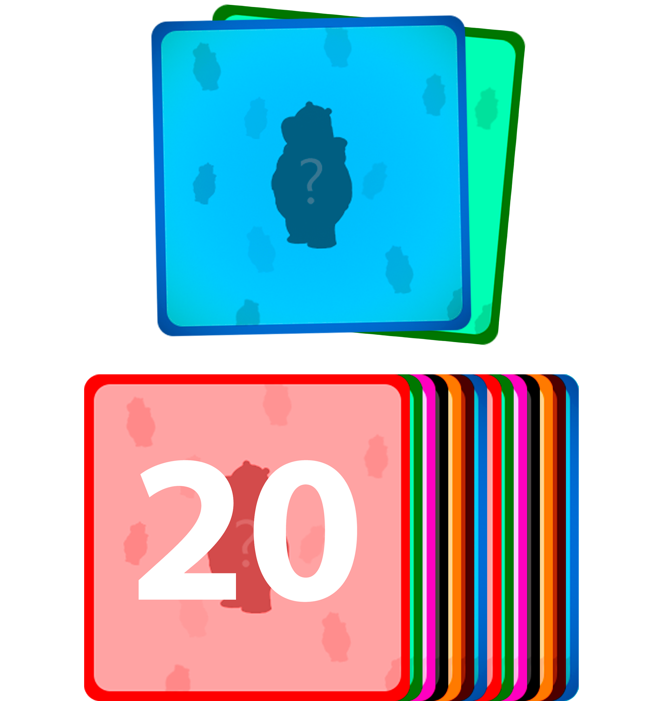
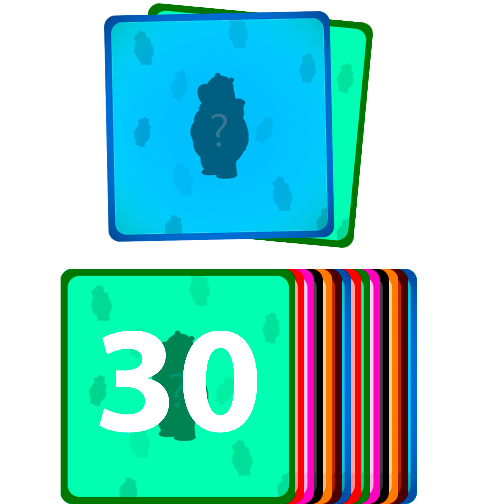
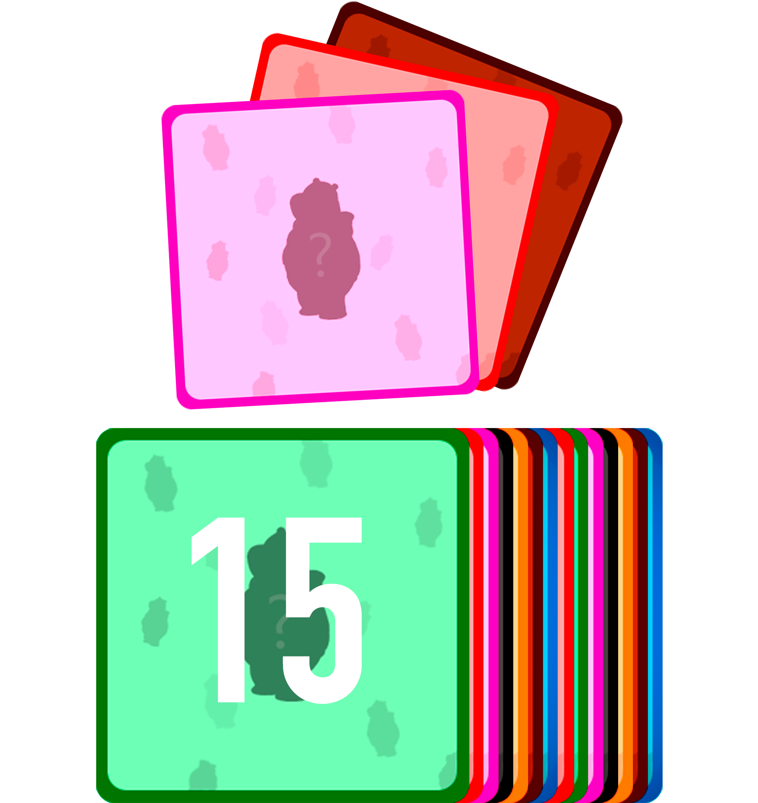
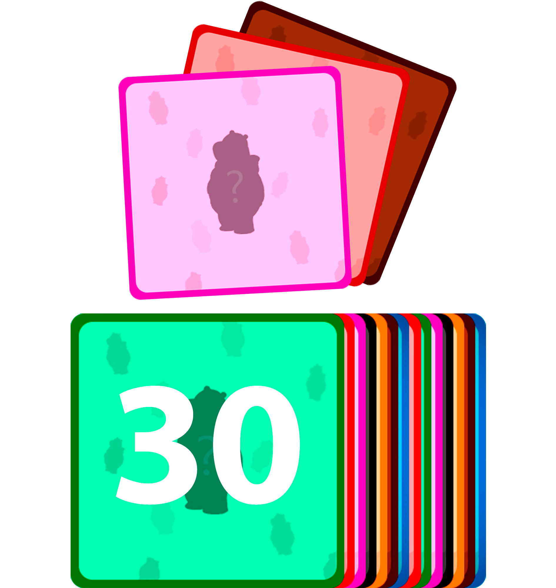

<div align="center">
  <a href="https://afonsobenedito.com/memory-game/">
    
  </a>

  <h1>Web Memory Game</h1>

  <p>
    A feature-rich, browser-based memory card game with multiple themes, game modes, and multiplayer support — all built with vanilla HTML, CSS, and JavaScript.
  </p>

  <p>
    <a href="https://afonsobenedito.com/memory-game/">
      
    </a>
  </p>

  <p>
    
    
    
    
    
  </p>
</div>

---

## Table of Contents

- [Overview](#overview)
- [Features](#features)
- [Game Modes](#game-modes)
- [Card Collections](#card-collections)
- [Berry the Bear](#berry-the-bear)
- [Pages](#pages)
- [Technologies](#technologies)
- [Authors](#authors)
- [License](#license)

---

## Overview

**Web Memory Game** is an interactive front-end web application centered around the classic memory card-flipping game. Built as a university project for the *Introduction to Web Technologies* course at [Faculdade de Ciências da Universidade de Lisboa](https://ciencias.ulisboa.pt/), it goes far beyond a standard memory game — featuring a hand-crafted canvas world map, animated characters, a custom mascot, multiple card theme collections, user accounts, and real-time multiplayer.

The mascot, **Berry the Bear**, guides you through the experience and appears in different color variants throughout the game as unlockable characters.


---

## Features

| Feature | Description |
|---|---|
| 🗺️ **Canvas World Map** | An interactive hand-drawn map built with the HTML5 Canvas API, with character animations, collision detection, and hidden Easter Eggs based on player position |
| 🃏 **Multiple Card Themes** | 6 unique card decks featuring iconic characters, each with its own visual identity |
| 🐻 **Berry the Bear** | The game's original mascot, available in 7 color variants to customize your experience |
| 👥 **Multiplayer** | Two players compete side-by-side in real-time on the same device |
| ⏱️ **Time Trial Mode** | Race against the clock — complete the board before time runs out |
| 🔱 **Trio Mode** | A harder variant where you must match 3 identical cards instead of 2 |
| 🏆 **Live Rankings** | Scoreboards updated automatically after every completed game |
| 🔐 **User Accounts** | Register, log in, play as a guest, or recover your account |
| ⚙️ **Settings** | Customize your username, email, password, game volume, and mobile mode |
| 🌍 **Bilingual** | Fully translated interface supporting **Portuguese** and **English** |
| 🔊 **Sound Design** | Background music, card flip sounds, and match feedback audio |
| 🥚 **Easter Egg** | Hidden in the map — explore and find it! |
| 📱 **Responsive** | Mobile-friendly mode for playing on smaller screens |

---

## Game Modes

<table>
  <tr>
    <td align="center"><strong>Pairs — 20 Cards</strong><br></td>
    <td align="center"><strong>Pairs — 30 Cards</strong><br></td>
    <td align="center"><strong>Trios — 15 Cards</strong><br></td>
    <td align="center"><strong>Trios — 30 Cards</strong><br></td>
  </tr>
</table>

- **Pairs Mode** — Classic memory: flip two cards and find all matching pairs
- **Trios Mode** — A harder challenge: find three matching cards at once
- **Time Trial** — Any mode can be played with a countdown timer for extra pressure

---

## Card Collections

The game features **7 card decks**, each with 15 unique illustrated cards:

| Deck | Characters |
|---|---|
| 🤖 **Doraemon** | Doraemon and friends |
| 🐱 **Garfield** | Garfield and his world |
| 🦅 **Phineas & Ferb** | Characters from the animated series |
| 🧽 **SpongeBob** | SpongeBob SquarePants cast |
| 🐢 **TMNT** | Teenage Mutant Ninja Turtles |
| 🐭 **Tom & Jerry** | Tom, Jerry, and their adventures |
| 🧚 **Winx Club** | Fairies from the Winx Club series |

All decks can be previewed in the [Contents](https://afonsobenedito.com/memory-game/Conteudos.html) section of the game.

---

## Berry the Bear

Berry is the original mascot created for this project. He appears as the site's favicon and logo, and is available in multiple color variants:

<div align="center">
  
  
  
  
  
  
  
</div>

---

## Pages

| Page | Description |
|---|---|
| [`index.html`](https://afonsobenedito.com/memory-game/) | Login, Register, Guest access & account recovery |
| `JogoPT.html` | Main game — Canvas world map, card board, multiplayer |
| `RulesPT.html` | Game rules and how to play |
| `RankingPT.html` | Global scoreboards and leaderboards |
| `ForumPT.html` | Community forum |
| `DefinitionsPT.html` | Glossary and definitions |
| `Conteudos.html` | All card decks and Berry variants gallery |

---

## Technologies

```
Frontend
├── HTML5          — Semantic markup & page structure
├── CSS3           — Styling, layout (Flexbox), animations
├── JavaScript     — Game logic, UI, event handling, multilingual support
└── Canvas API     — Interactive world map, character sprites & animation

Storage
├── localStorage   — Persistent user data (accounts, scores)
└── sessionStorage — Session state (current player, page context)

Assets
├── Custom Font    — Burbank Small Medium (.otf)
├── Audio          — Background music and sound effects (.mp3 / .ogg)
└── Original Art   — Berry the Bear mascot, background, map illustrations
```

---

## Authors

Developed by three **Information Technologies** students from [Faculdade de Ciências da Universidade de Lisboa](https://ciencias.ulisboa.pt/) as part of the *Introduction to Web Technologies* course.

<table>
  <tr>
    <td align="center">
      <strong>Afonso Benedito</strong><br>
      <sub>nº 54937</sub>
    </td>
    <td align="center">
      <strong>Afonso Teles da Silva</strong><br>
      <sub>nº 54945</sub>
    </td>
    <td align="center">
      <strong>Tomás Ndlate</strong><br>
      <sub>nº 54970</sub>
    </td>
  </tr>
</table>

---

## License

This project is licensed under the [MIT License](LICENSE).

---

<div align="center">
  <a href="https://afonsobenedito.com/memory-game/">
    
  </a>
  <br>
  <sub>Made with ❤️ by Afonso Benedito, Afonso Teles & Tomás Ndlate · FCUL</sub>
</div>
